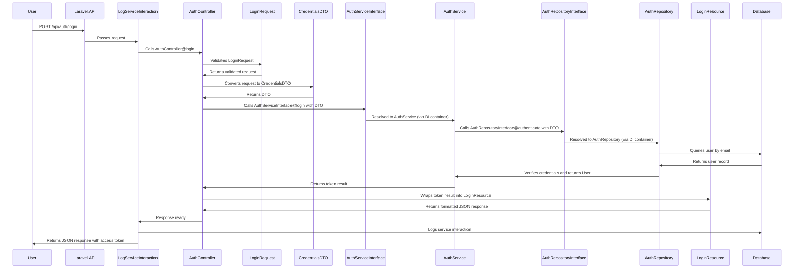
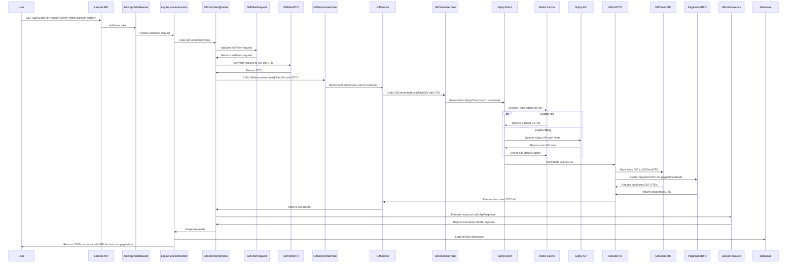

# GIFHub API

## Project Description

GIFHub is an API designed to manage GIF searches and favorites using
Giphy as an external provider. The API is built for scalability and
security, featuring Passport authentication and Redis-based caching.

---

### Database Design

The application follows a relational database structure with the following key entities:

- **Users**: Represents authenticated users in the system.
- **Favorite GIFs**: Stores GIFs saved by users, allowing aliasing for personalized identification.
- **Service Logs**: Tracks API interactions for monitoring and debugging purposes.

Below is the Entity-Relationship Diagram (ERD) that illustrates these relationships:


This diagram demonstrates:

- **One-to-Many Relationships**:
- Users can have multiple favorite GIFs.
- Users can generate multiple service logs.

### Notes on Database Design

- **Unique Constraint on Favorite GIFs**: The `favorite_gifs` table enforces a **unique constraint** on the combination of `user_id` and `gif_id`. This ensures that a user cannot save the same GIF more than once, maintaining data consistency.

---

## Use Case Diagram

The following diagram illustrates the main use cases of the application:

- **Actors**:

  - **User**: Represents the API user.
  - **System**: Handles interaction logging.

- **Key Use Cases**:
    1. **Authenticate via API**: User authentication and token generation.
    2. **Search for GIFs**: Query GIFs based on a keyword.
    3. **Get GIF details**: Fetch detailed information about a specific GIF.
    4. **Save GIF as favorite**: Add a GIF to the user's list of favorites.
    5. **Log service interactions**: Automatically log all interactions.


### Usage

- Users can explore the API endpoints defined in the project.
- All interactions are logged automatically for auditing and debugging purposes.

---

### Workflow Diagrams

This section contains detailed sequence diagrams to demonstrate the flow of each
key use case within the system. These diagrams illustrate how requests are
processed through various layers of the application, including controllers,
middlewares, services, repositories, and external APIs.

#### **1. Authenticate via API**

This diagram outlines the flow for user authentication and token generation:



#### **2. Search for GIFs**

This diagram demonstrates the workflow for querying GIFs from the Giphy API:



---

## System Requirements

No special requirements are needed on your host machine, as all dependencies
are containerized using Docker. Just ensure you have:

- **Docker:** Version 20.10 or higher.
- **Docker Compose:** Version 1.29 or higher.
- **Make:** Installed on your machine (optional but recommended).

---

## Deployment Instructions

### Step 1: Clone the Repository

Clone the repository to your local machine:

```bash
git clone <REPOSITORY_URL>
cd gifhub
```

### Step 2: Configure Environment Variables

Copy the `.env.example` file as `.env` to configure your environment:

```bash
cp .env.example .env
```

Ensure you add your Giphy API Key in the .env file:

```env
GIPHY_API_KEY=your_giphy_api_key_here
```

### Step 3: Build and Start Containers

Run the following command to build and start the Docker services:

```bash
make setup
```

This command will:

- Build the required containers.
- Install Laravel dependencies.
- Generate the application key and Passport keys.
- Run database migrations and seed sample data.

### Step 4: Start the Server

To start the application and serve it locally:

```bash
make serve
```

The API will be accessible at:

```bash
http://localhost:8000/api
```

---

## Postman Collection and Environment

We provide a Postman collection and environment file for easy interaction
with the API.

### Download Links

- **Collection:** [GIFHub Postman Collection](https://github.com/The0ld/GIFHub/blob/main/docs/GIFHub%20API.postman_collection.json)
- **Environment:** [GIFHub Postman Environment](https://github.com/The0ld/GIFHub/blob/main/docs/GIFHub.postman_environment.json)

### Instructions

1. Import the collection and environment into Postman.
2. Ensure the `base_url` variable in the environment is set to:

    ```bash
    http://localhost:8000/api
    ```

3. The collection includes:
    - Authentication routes (login).
    - Favorite GIF management routes.
    - GIF search routes.

---

## Useful Commands

Here are some commonly used commands for managing the project:

- **Start the project:**

    ```bash
    make up
    ```

- **Stop the containers:**

    ```bash
    make down
    ```

- **Run tests:**

    ```bash
    make test
    ```

- **View logs for the application container:**

    ```bash
    docker compose logs -f app
    ```

---

## Additional Resources

- **Laravel Documentation:** [https://laravel.com/docs](https://laravel.com/docs)
- **Docker Documentation:** [https://docs.docker.com/](https://docs.docker.com/)
- **Giphy API Documentation:** [https://developers.giphy.com/](https://developers.giphy.com/)

---

## License

This project is licensed under the [MIT License](LICENSE).
